# Tech Challenge - Fase 3

## Predição e Inteligência Analítica para Alfabetização no Brasil

Projeto desenvolvido durante a **Fase 3 da Pós-Tech Data & AI Scientist**, com foco na aplicação de técnicas de Machine Learning para predição da alfabetização individual a partir de dados educacionais, territoriais e socioeconômicos.

> **Status:** fluxo de dados, modelagem supervisionada, avaliação territorial, auditorias metodológicas, clustering municipal e projeção de risco de meta concluídos.

---

## Contexto do problema

A alfabetização na idade certa é um dos principais indicadores de desenvolvimento educacional e social do país. Conhecer apenas o retrato atual, porém, não basta para apoiar decisão pública: gestores precisam antecipar risco, identificar territórios vulneráveis e entender quais fatores mais pesam sobre o indicador.

Este projeto dá continuidade ao pipeline de Engenharia de Dados desenvolvido no **Tech Challenge da Fase 2**, em que foram construídas as camadas de ingestão, tratamento e integração dos dados do Indicador Criança Alfabetizada, incluindo a **camada Gold** usada aqui como fonte das features analíticas.

O objetivo da Fase 3 é transformar esses dados em uma solução de **Machine Learning supervisionado** e, mais do que isso, em inteligência aplicável ao contexto educacional brasileiro.

---

## Objetivo analítico

O problema foi estruturado como **classificação binária supervisionada**, com unidade de análise no **aluno avaliado em 2024**.

A variável-alvo `alfabetizado` assume:

- `0`: não alfabetizado;
- `1`: alfabetizado.

O modelo estima a condição de alfabetização individual usando informações históricas e contextuais, **sem utilizar o resultado contemporâneo da avaliação do próprio aluno**.

A hipótese central é que a combinação entre histórico educacional do município e da rede, contexto territorial, indicadores socioeconômicos e metas educacionais contém informação relevante para estimar a probabilidade de alfabetização individual.

---

## Descrição da base utilizada

### Origem

As **features de contexto** vêm da camada Gold construída na Fase 2, armazenada no Amazon S3. As tabelas Gold efetivamente consumidas pelo dataset de modelagem são três:

| Tabela Gold | O que fornece |
|---|---|
| `indicador_alfabetizacao_municipio` | taxa de alfabetização, média de Português e participação do município em 2023 |
| `desempenho_alunos_municipio` | total de alunos, percentual de alfabetizados e proficiência média ponderada em 2023 |
| `comparativo_metas_resultados` | metas municipais para 2024, gap para a meta e os indicadores IDHM em nível de UF |

A quarta tabela Gold, `evolucao_temporal_indicador`, está mapeada no leitor mas **não é consumida** pelo dataset atual — a decisão de não construir série histórica está registrada na DEC-014.

A **população e o target** vêm da camada Silver `alunos`. Esse ponto merece destaque: o catálogo Gold da Fase 2 é inteiramente agregado por município, UF ou Brasil, e não existe tabela Gold em granularidade de aluno. Como o enunciado exige prever *se um aluno* será alfabetizado, o target individual não poderia ser obtido apenas da Gold. O desvio é consciente e está formalizado na **DEC-018**.

### Dataset de modelagem

- **1.851.828 alunos**, **24 colunas**;
- sem duplicidade em `id_aluno` e sem nulo no target;
- distribuição do alvo: **59,8% alfabetizados**, **40,2% não alfabetizados**;
- composição: **86,98% rede Municipal**, **13,02% rede Estadual**;
- cobertura da integração com o histórico Gold: **98,08% dos alunos**.

### Features

São 16 features brutas, que o pré-processamento expande para 43 colunas codificadas.

| Dimensão | Features |
|---|---|
| Histórico educacional 2023 | `taxa_alfabetizacao_municipio_2023`, `media_portugues_municipio_2023`, `percentual_participacao_municipio_2023`, `total_alunos_municipio_2023`, `pct_alfabetizados_municipio_2023`, `proficiencia_media_ponderada_2023` |
| Metas educacionais | `meta_alfabetizacao_municipio_2024`, `gap_para_meta_municipio_2024`, `atingiu_meta_municipio_2024` |
| Territorial | `sigla_uf`, `rede` |
| Socioeconômico | `idhm`, `idhm_educacao`, `idhm_renda`, `idhm_longevidade` |
| Auxiliar | `gold_historico_disponivel` |

Detalhes do contrato em [Definição do dataset](reports/modeling_dataset_definition.md).

---

## Estratégia temporal

O target é a classificação individual observada em **2024**. Para reduzir risco de data leakage, os preditores educacionais são de **2023**.

As três variáveis de meta merecem explicação: `meta_alfabetizacao_municipio_2024` é a meta publicada, `gap_para_meta_municipio_2024` é a diferença entre a meta e a **taxa de 2023**, e `atingiu_meta_municipio_2024` indica se a taxa de **2023** já alcançava a meta. Nenhuma delas usa o resultado observado em 2024. A identidade é verificada em código, com correspondência de **100%**.

---

## Análise Exploratória de Dados

A EDA completa está em [`notebooks/01_eda.ipynb`](notebooks/01_eda.ipynb), com os gráficos executados e versionados.

### Distribuição do alvo

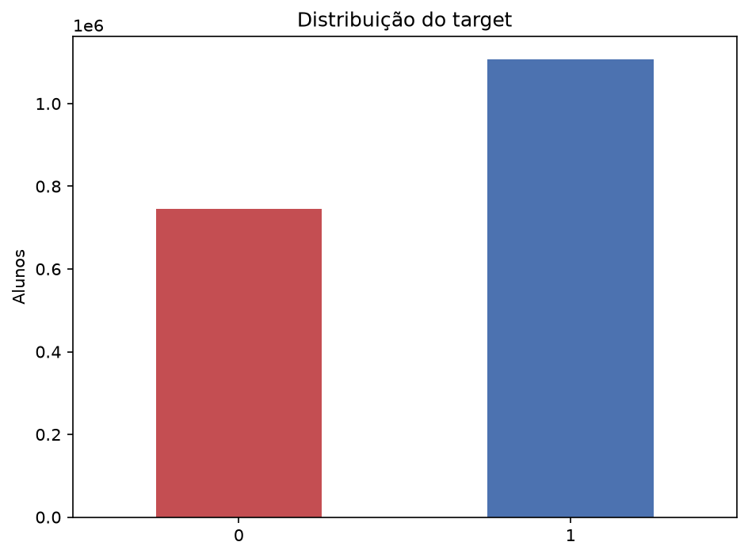

### Valores ausentes

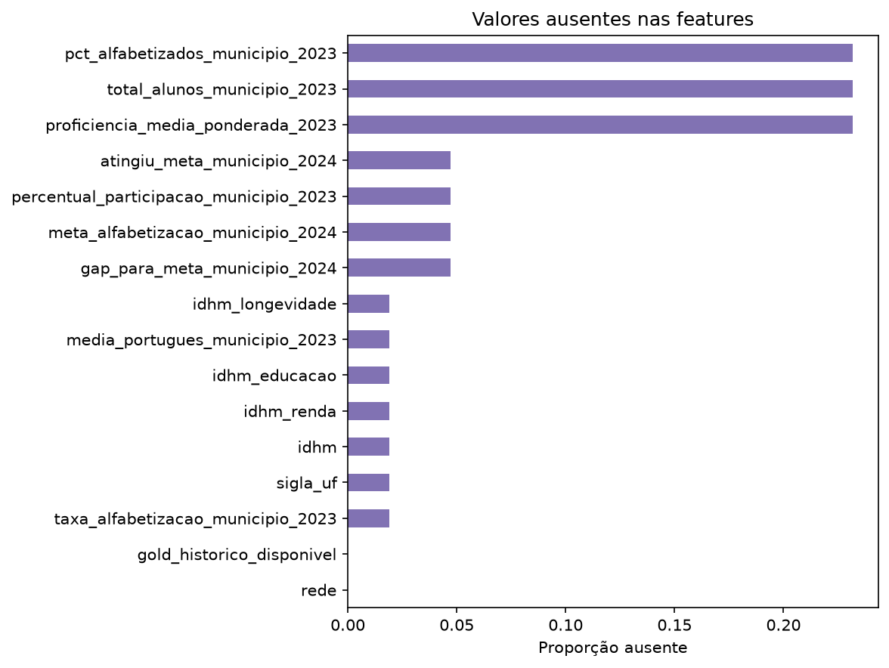

As ausências são estruturais: municípios sem correspondência no histórico Gold. A flag `gold_historico_disponivel` preserva essa informação em vez de descartá-la.

### Correlação e redundância

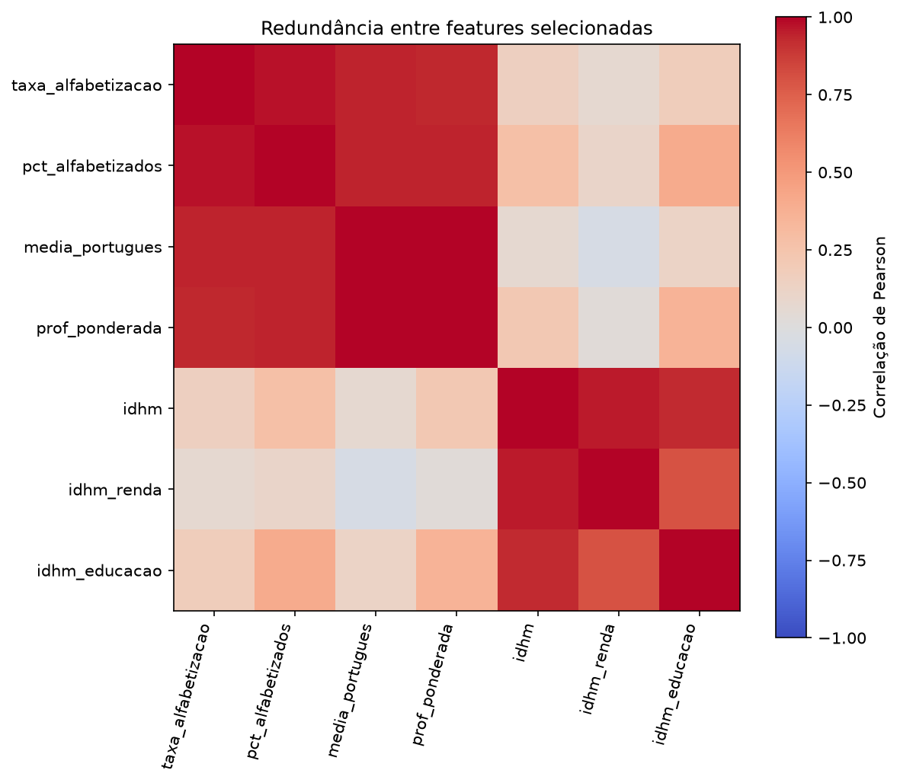

Os indicadores educacionais de 2023 são fortemente correlacionados entre si, o que era esperado: medem facetas do mesmo fenômeno municipal.

### Principais achados

- Municípios no quintil inferior de desempenho histórico apresentam taxa de alfabetização de **42,6%**, contra **77,1%** no quintil superior — a maior separação observada na EDA;
- há gradiente territorial claro entre UFs;
- o IDHM se associa positivamente ao indicador, mas sua granularidade estadual limita o poder de discriminação entre municípios.

---

## Prevenção de data leakage

A auditoria de linhagem encontrou um caso de leakage direto. A variável `proficiencia` reconstrói o target com **100% de acurácia** pelo corte oficial do INEP em 743 pontos, com **zero divergências** nos 1.851.828 alunos.

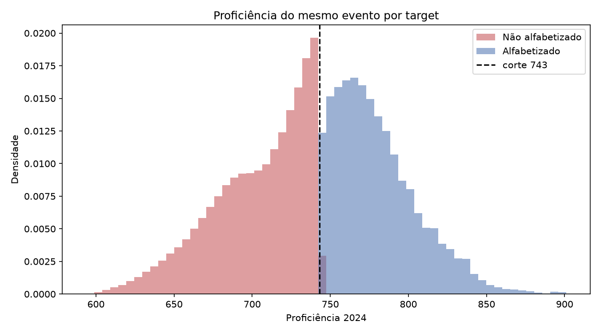

A separação é perfeita e a variável foi excluída. O bloqueio não é apenas documental: existe uma lista `FORBIDDEN` em `src/modeling/final_validation.py` que levanta erro se alguém tentar reintroduzi-la, coberta por teste automatizado.

O segundo mecanismo de prevenção é o **split agrupado por município**: nenhum município aparece em mais de uma partição, de modo que o modelo nunca é avaliado em território que já viu. O target nunca é passado ao divisor, e há teste que inverte o alvo e exige split idêntico.

Detalhes em [Auditoria da linhagem](reports/target_lineage_audit.md) e [Definição do split](reports/modeling_split_definition.md).

---

## Etapas de modelagem

1. auditoria e entendimento dos dados;
2. validação da camada Gold da Fase 2;
3. consolidação das features históricas;
4. construção do dataset individual de modelagem;
5. Análise Exploratória de Dados;
6. análise e prevenção de data leakage;
7. definição das features candidatas;
8. separação de treino, validação e teste por município;
9. construção do pipeline de pré-processamento;
10. modelos baseline;
11. treinamento e comparação de modelos supervisionados;
12. otimização de hiperparâmetros na validação;
13. avaliação de generalização e overfitting;
14. seleção e congelamento do modelo final;
15. abertura única do conjunto de teste;
16. interpretabilidade;
17. clustering municipal e projeção de risco de meta;
18. geração de insights e discussão de políticas públicas.

### Pipeline de pré-processamento

Todo o pré-processamento está **integrado ao `Pipeline` do scikit-learn**, de modo que o `fit` ocorre exclusivamente sobre o treino:

| Etapa | Tratamento |
|---|---|
| Imputação numérica | `SimpleImputer(strategy="median")` |
| Imputação categórica | `SimpleImputer(strategy="most_frequent")` |
| Encoding categórico | `OneHotEncoder(handle_unknown="ignore")`, esparso |
| Escala numérica | `StandardScaler`, aplicado somente à regressão logística |

O objeto serializado contém pré-processamento e estimador juntos, e é esse artefato único que a avaliação final carrega — não há transformação manual fora do pipeline em nenhum ponto do fluxo supervisionado.

### Divisão dos dados

`GroupShuffleSplit` agrupado por `id_municipio`, com semente 42:

| Partição | Alunos | Proporção |
|---|---:|---:|
| Treino | 1.311.003 | 70% |
| Validação | 297.079 | 15% |
| Teste | 243.746 | 15% |

Sobreposição de município e de aluno entre as partições: **zero**, verificada em código.

---

## Escolha do algoritmo

Onze candidatos foram comparados **usando apenas treino e validação**.

| Modelo | ROC AUC validação | Gap treino/validação | F1 validação | Tempo (s) |
|---|---:|---:|---:|---:|
| **`random_forest_controlled`** | **0,6409** | **0,0343** | 0,7462 | 123,4 |
| `decision_tree_d5_l100` | 0,6307 | 0,0310 | 0,7438 | 10,4 |
| `decision_tree_d10_l100` | 0,6302 | 0,0449 | 0,7395 | 31,9 |
| `decision_tree_d10_l500` | 0,6301 | 0,0442 | 0,7403 | 30,4 |
| `decision_tree_d7_l100` | 0,6294 | 0,0392 | 0,7446 | 17,0 |
| `decision_tree_d15_l500` | 0,6285 | 0,0507 | 0,7352 | 56,2 |
| `decision_tree_baseline` | 0,6214 | 0,0603 | 0,7298 | 61,4 |
| `logistic_baseline` | 0,6186 | 0,0475 | 0,6819 | 48,8 |
| `logistic_tuned_c_0_3` | 0,6184 | 0,0477 | 0,6819 | 45,6 |
| `logistic_tuned_c_0_1` | 0,6182 | 0,0479 | 0,6820 | 44,9 |
| `dummy_prior` | 0,5000 | 0,0000 | 0,7523 | 5,0 |

**Modelo escolhido:** `RandomForestClassifier` com `n_estimators=40`, `max_depth=10`, `min_samples_leaf=200`, `max_features="sqrt"`, `n_jobs=2` e `random_state=42`.

**Regra de seleção:** entre os candidatos a até 0,002 da melhor ROC AUC, prefere-se o de menor gap treino/validação, depois maior F1, depois menor tempo. A regra evita escolher por diferenças de AUC dentro do ruído — precaução necessária porque não houve validação cruzada (DEC-010).

**Por que a Random Forest e não a árvore simples:** a floresta tem a melhor AUC com gap comparável ao da árvore mais rasa, e a agregação de 40 árvores reduz a variância das estimativas de probabilidade, que é o que efetivamente se usa no ranking territorial.

**Por que a regressão logística ficou atrás:** as relações entre indicadores contextuais e o alvo não são lineares no espaço das features, e a padronização esparsa usada para preservar a matriz one-hot não centraliza os dados, o que prejudica a convergência do solver.

---

## Métricas de avaliação

**A métrica primária é a ROC AUC.** A tabela acima mostra exatamente por quê: o `dummy_prior`, que prevê a classe majoritária para todo mundo, obtém o **maior F1 de todos os candidatos** (0,7523) enquanto tem AUC de 0,5000, ou seja, zero capacidade de discriminação. Com alvo desbalanceado em 59,8/40,2 e uso final de **ordenação por risco**, métricas dependentes de limiar são enganosas; a ROC AUC mede a qualidade do ordenamento, que é o que o produto analítico realmente entrega.

As métricas de apoio, reportadas por classe, são balanced accuracy, precision, recall e F1. O **gap entre treino e validação** entra como critério de seleção para controlar overfitting.

**Não há limiar operacional congelado.** O valor 0,50 aparece apenas como referência descritiva. A decisão de não fixar limiar foi tomada após auditoria semântica: a escolha do corte depende do custo relativo entre deixar de sinalizar um território em risco e gerar alarme falso, e essa é uma decisão de política pública, não estatística.

---

## Interpretação dos resultados

### Avaliação final em municípios inéditos

Após o congelamento do protocolo, o conjunto de teste foi aberto **uma única vez**. Aplicou-se a Random Forest ajustada somente no treino, sem refit, retuning ou alteração de features.

O teste contém **243.746 alunos de 828 municípios** ausentes do treino e da validação.

| Métrica | Validação | Teste |
|---|---:|---:|
| ROC AUC | 0,6409 | **0,6631** |

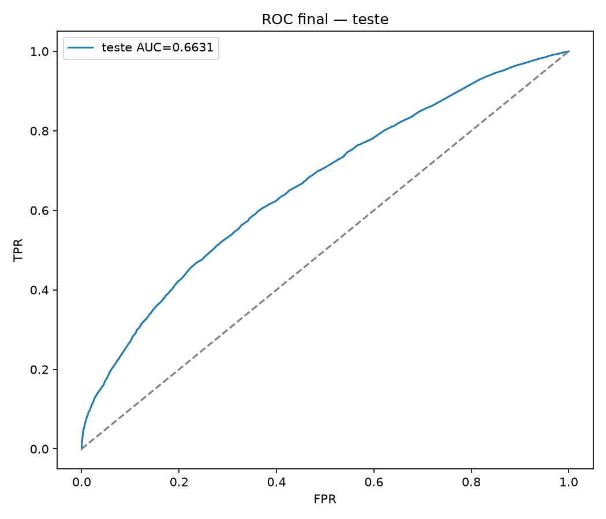

A diferença de **+0,0222** é classificada como moderada pelo próprio protocolo. O teste ficou **acima** da validação, o que afasta overfitting de seleção e indica uma partição de teste marginalmente mais favorável — a estimativa de generalização deve ser lida com essa ressalva.

No limiar descritivo 0,50, a balanced accuracy foi 0,5832 e, para a classe de risco, precision/recall/F1 foram 0,5609/0,3426/0,4254.

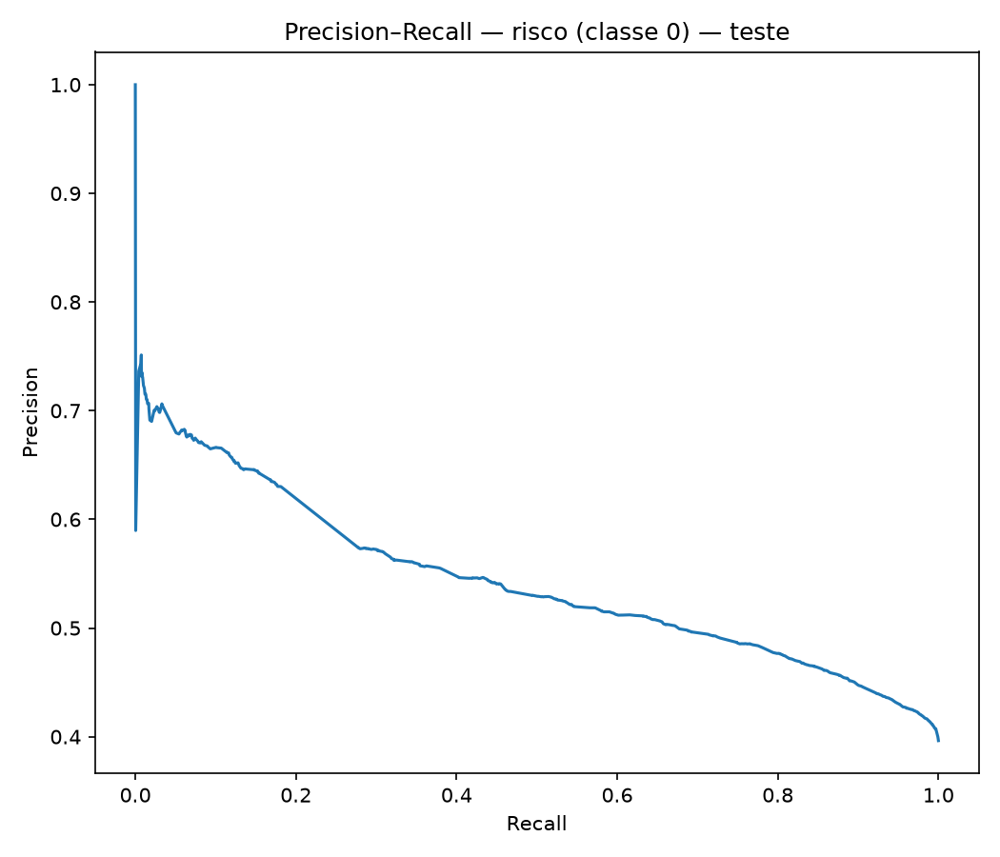

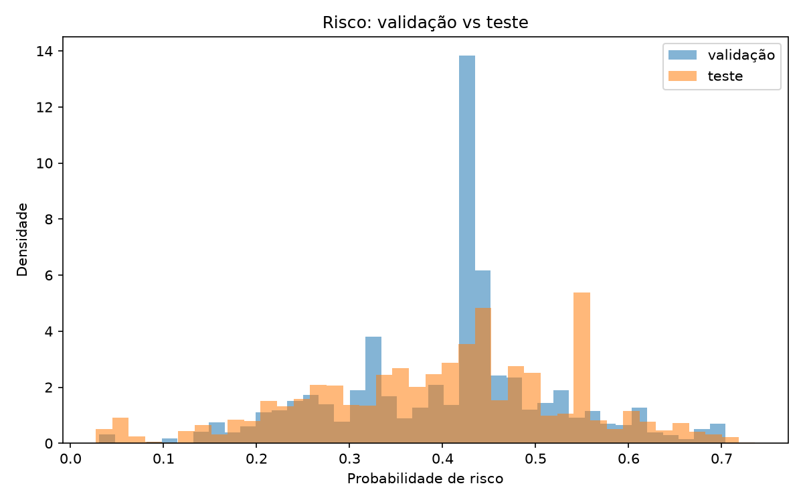

As distribuições de risco em validação e teste se sobrepõem, sinal de que o modelo se comporta de forma estável em território novo.

### Por que a AUC fica em torno de 0,66

Esta é a pergunta mais importante do projeto, e a resposta não é "o modelo é ruim" — é uma característica estrutural dos dados, medida e documentada.

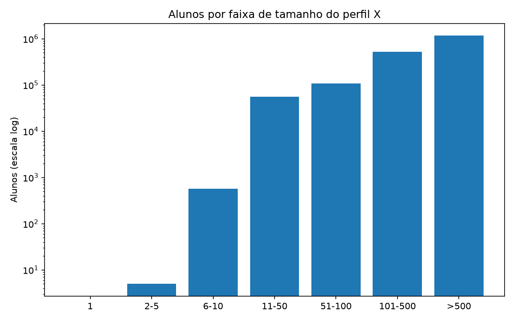

Existem apenas **6.430 perfis distintos de features** para 1.851.828 alunos. Nenhum aluno tem vetor único: **100% estão em perfis compartilhados**.

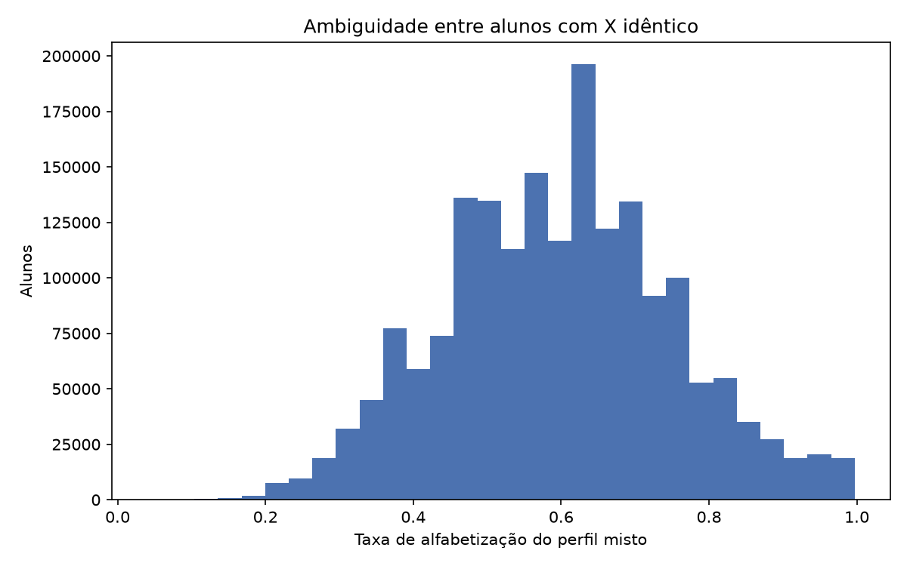

E **99,82% dos alunos** estão em perfis "mistos", em que o mesmo vetor de features corresponde a alunos alfabetizados e não alfabetizados. Cerca de **90% da variabilidade do alvo ocorre dentro dos contextos**, não entre eles.

A consequência é direta: qualquer classificador determinístico tem teto baixo aqui. O teto empírico de acurácia por voto majoritário no perfil é de **0,6482**. O modelo não está longe do limite do que essas features permitem.

**A leitura correta, portanto, é territorial:** o que o modelo produz é uma estimativa de risco contextual do município e da rede, não um diagnóstico individual. Detalhes em [Auditoria de granularidade](reports/granularity_audit.md).

### Interpretabilidade

Importância nativa da Random Forest final, reagregada das 43 colunas codificadas para as 16 features de origem:

| Feature | Importância |
|---|---:|
| `media_portugues_municipio_2023` | 0,1578 |
| `proficiencia_media_ponderada_2023` | 0,1263 |
| `pct_alfabetizados_municipio_2023` | 0,1235 |
| `taxa_alfabetizacao_municipio_2023` | 0,1155 |
| `meta_alfabetizacao_municipio_2024` | 0,1097 |
| `gap_para_meta_municipio_2024` | 0,0892 |
| `idhm_educacao` | 0,0700 |
| `sigla_uf` | 0,0628 |

Ranking completo em `reports/final_feature_importance.csv`.

**SHAP não foi executado.** A execução depende do modelo serializado e do parquet de modelagem, e nenhum dos dois é versionado. Permanece como pendência explícita, não como decisão de descarte. Nenhuma importância recebe interpretação causal.

---

## Perguntas de negócio

### Quais fatores mais impactam a alfabetização?

O desempenho educacional histórico do município domina: as quatro primeiras posições da importância são indicadores de 2023, somando 52,3% da importância total. O contexto socioeconômico aparece em seguida, liderado pelo `idhm_educacao`. Na EDA, a diferença entre o quintil inferior e o superior de desempenho histórico é de 42,6% contra 77,1% de alfabetização.

### Quais municípios apresentam maior risco educacional?

O ranking por `prob_risco = 1 - P(alfabetizado)` está em `reports/final_test_municipal_analysis.csv`, com 828 municípios, e em `reports/final_test_context_ranking.csv`, detalhado por município e rede.

### Quais regiões possuem padrões semelhantes?

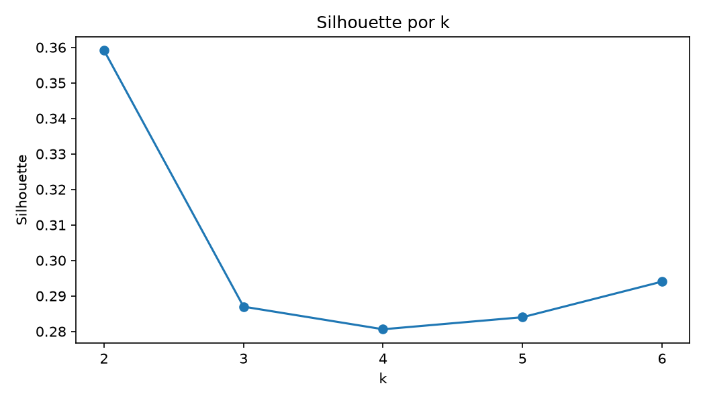

K-means sobre 5.517 municípios, avaliando `k=2..6`. Escolhido **k=2**, com Silhouette 0,3591 e estabilidade ARI entre 0,9971 e 1,0 em cinco sementes.

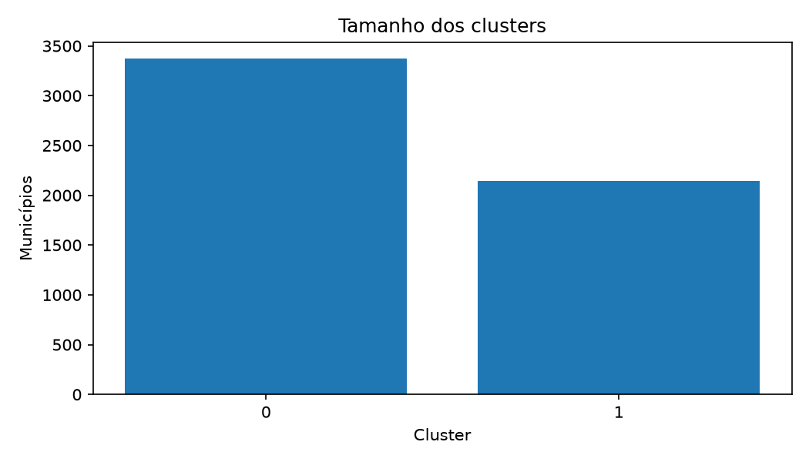

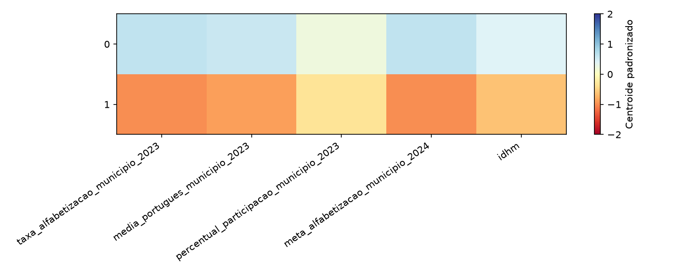

O agrupamento separa 3.371 municípios de contexto mais favorável de 2.146 com maior vulnerabilidade relativa. O segundo perfil tem risco médio pós-hoc de 0,4890, contra 0,2936 no primeiro. Na prática a divisão é próxima de um corte Sul/Sudeste contra Norte/Nordeste — interpretável, porém de granularidade baixa para priorização fina. Detalhes em [Clustering municipal](reports/municipal_clustering_results.md).

### Como prever municípios que podem não atingir metas futuras?

A probabilidade média de alfabetização prevista pelo modelo é usada como projeção da taxa municipal de 2024 e comparada com a meta do município.

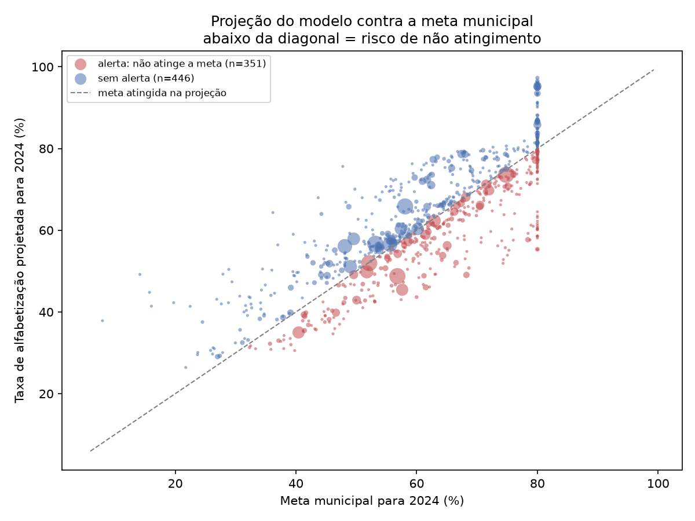

Municípios abaixo da diagonal recebem alerta de risco de não atingimento: **351 dos 797 municípios** avaliados, todos inéditos para o modelo.

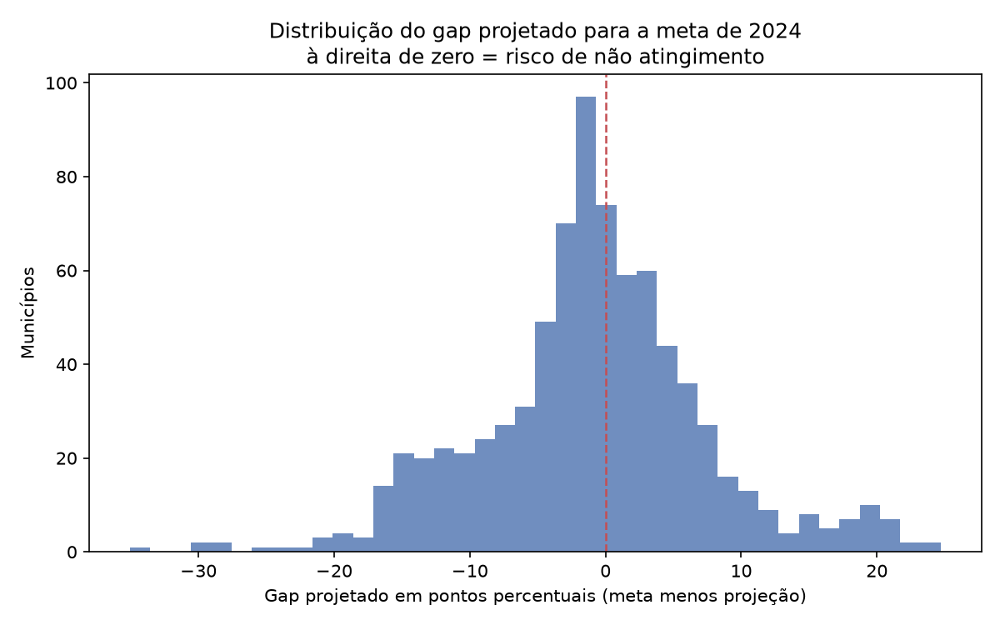

Como o conjunto de teste carrega a taxa efetivamente observada em 2024, **a projeção pode ser auditada contra o desfecho real**:

| Estratégia | Acurácia | Precisão | Recall | F1 |
|---|---:|---:|---:|---:|
| Projeção do modelo | **0,7026** | 0,6667 | 0,6610 | 0,6638 |
| Linha de base: repetir a taxa de 2023 | 0,4780 | 0,4506 | 0,7994 | 0,5764 |

O alerta do modelo acerta 70,3% dos municípios, contra 47,8% da linha de base ingênua. A linha de base tem recall alto porque sinaliza quase todo mundo, e por isso sua precisão desaba. O ganho está em **separar quem realmente corre risco de quem não corre**. Detalhes em [Risco de meta 2024](reports/goal_risk_2024.md).

### Quais variáveis possuem maior influência nos modelos?

Ver a tabela de importância na seção de interpretação. Com a ressalva de que SHAP não foi executado, a leitura de influência se apoia na importância nativa da floresta, que é associativa e sensível a correlação entre preditores — e os indicadores de 2023 são fortemente correlacionados entre si.

---

## Insights encontrados

**O histórico municipal é o melhor previsor disponível, e isso tem um custo.** As features de 2023 concentram mais da metade da importância do modelo. Isso confirma a hipótese central, mas também revela dependência de trajetória: municípios historicamente mal posicionados tendem a ser previstos como de alto risco, o que é útil para priorizar e perigoso para rotular.

**O modelo enxerga território, não aluno.** Com 99,82% dos alunos em perfis ambíguos e 90% da variância do alvo ocorrendo dentro dos contextos, a informação disponível é quase inteiramente territorial. Esse é o achado metodológico mais relevante do projeto, e ele reposiciona o produto: o que se entrega é um instrumento de priorização territorial.

**Metas estaduais têm ambição muito desigual.** A meta média no Rio Grande do Sul é de 71,8%, contra 61,8% no conjunto avaliado. Um ranking por gap absoluto para a meta fica dominado por UFs mais ambiciosas, ainda que partam de patamares melhores. Comparar municípios por distância até a meta sem considerar isso produz priorização enviesada.

**O modelo supera de longe a projeção ingênua.** Supor que 2024 repete 2023 acerta 47,8% dos casos; o modelo acerta 70,3%. Para uma secretaria que precisa decidir onde agir antes do resultado sair, essa diferença é a justificativa prática do projeto.

**Duas fontes externas foram testadas e recusadas com evidência.** O Censo Escolar 2023 teve cobertura zero no join por `id_escola`, indicando chave anonimizada ou recodificada.

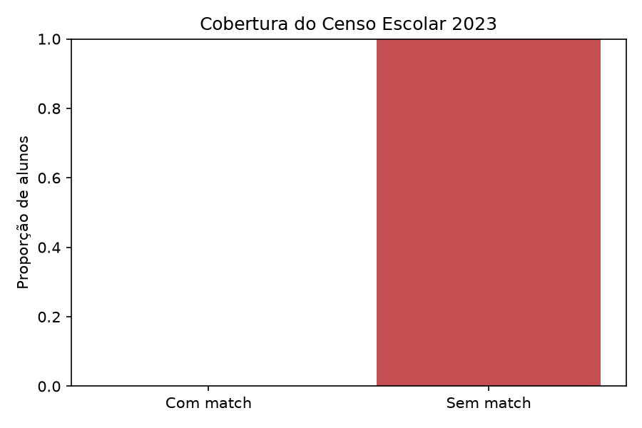

Documentar uma tentativa fracassada com evidência vale mais do que omiti-la: [Viabilidade do Censo Escolar](reports/censo_escolar_feasibility.md).

---

## Aplicação prática para políticas públicas

O produto entregue não é "a previsão de um aluno". É um **instrumento de priorização territorial** com três usos concretos.

**1. Triagem para diagnóstico aprofundado.** O ranking por `prob_risco` ordena municípios e redes. Uma secretaria estadual com capacidade para visitar 50 municípios por ciclo usa o ranking para escolher quais, em vez de distribuir a equipe uniformemente. O ganho não está na precisão individual, e sim em concentrar atenção onde a probabilidade de encontrar problema é maior.

**2. Alerta antecipado de meta.** A projeção de risco de não atingimento sinaliza, **antes da divulgação do resultado**, quais municípios tendem a ficar abaixo da meta — com 70,3% de acerto contra 47,8% da alternativa ingênua. Isso abre janela para ação corretiva dentro do próprio ciclo letivo.

**3. Segmentação para desenho de programa.** O clustering separa municípios de contexto favorável dos de maior vulnerabilidade. Programas desenhados para um perfil raramente funcionam no outro, e a segmentação dá base empírica para diferenciar.

**Como usar sem errar.** Três recomendações operacionais:

- **Combine os dois rankings.** O de risco absoluto (`final_test_municipal_analysis.csv`) e o de gap para meta (`goal_risk_ranking.csv`) respondem perguntas diferentes. O primeiro aponta onde o problema é maior; o segundo, onde a meta está mais ameaçada. Municípios no topo de ambos são a prioridade inequívoca.
- **Defina o limiar segundo o custo da decisão.** O projeto deliberadamente não congelou um corte. Para triagem de visitas, com custo baixo de falso alarme, use limiar permissivo e privilegie recall. Para alocação orçamentária, com custo alto, privilegie precisão.
- **Nunca use no nível do aluno.** O modelo atribui a mesma probabilidade a todos os alunos do mesmo município e rede. Usá-lo para classificar crianças individualmente não é apenas impreciso: é uma aplicação incorreta do instrumento.

**O que o modelo não sustenta:** conclusões causais, diagnóstico pedagógico individual e previsão oficial de cumprimento de meta. As associações identificadas são padrões preditivos, não relações de causa e efeito.

---

## Limitações do projeto

- Parte das features tem granularidade municipal, de rede ou estadual, enquanto o alvo é individual;
- alunos do mesmo município e rede compartilham o mesmo vetor e recebem a mesma probabilidade — o modelo representa risco contextual, não diagnóstico individual;
- os indicadores socioeconômicos disponíveis têm granularidade estadual: 27 valores de IDHM para 5.570 municípios;
- **não foi executada validação cruzada agrupada**; com holdout único não há estimativa de variância entre folds, e diferenças de AUC na casa de 0,002 entre candidatos próximos não são estatisticamente distinguíveis;
- a otimização de hiperparâmetros usou grade manual pequena e definida a priori;
- a diferença de AUC entre teste e validação é de +0,0222, classificada como moderada;
- **SHAP não foi executado**;
- os indicadores educacionais são de 2023 e o alvo é de 2024;
- as associações não representam relações causais;
- **a reprodução completa da pipeline exige credenciais de leitura no bucket S3 privado da equipe**; sem elas é possível executar a suíte de testes e a análise de risco de meta, mas não regenerar o dataset de modelagem;
- a POC com Censo Escolar teve cobertura zero por incompatibilidade de chave, e a fonte não foi incorporada.

Lista completa em [Limitações da modelagem](reports/modeling_limitations.md).

---

## Estrutura do projeto

```text
tech-challenge-fase3/
│
├── data/                  # artefatos locais, não versionados
│   ├── raw/
│   ├── processed/
│   └── gold/
│
├── notebooks/
│   ├── 00_test_build_modeling_dataset.ipynb
│   ├── 00_test_gold_integration.ipynb
│   └── 01_eda.ipynb
│
├── src/
│   ├── preprocessing/     # leitura, integração e contrato do dataset
│   ├── modeling/          # split, treino, validação, auditorias e análises
│   ├── evaluation/        # métricas compartilhadas
│   └── visualization/     # primitivas de gráfico
│
├── tests/                 # 96 testes automatizados
├── reports/               # documentação técnica, decisões e resultados
├── images/                # gráficos gerados pelos scripts
├── conftest.py
├── requirements.txt
├── README.md
└── .gitignore
```

### Testes

O projeto tem **96 testes automatizados** cobrindo contrato do dataset, integridade do split, ausência de vazamento, pré-processamento, auditorias e visualização. Todos usam dados sintéticos ou mocks: **nenhum depende de credencial, S3 ou BigQuery**.

```bash
pytest tests -q
```

Destacam-se os testes que protegem a validade metodológica: um inverte o target e exige split idêntico, provando que o alvo não influencia a divisão; outro inspeciona o código-fonte da validação para garantir que ele nunca referencia o conjunto de teste; um terceiro verifica que o bloqueio de reabertura do teste vem antes de qualquer materialização dos dados.

---

## Reprodutibilidade

### O que roda sem credencial alguma

Um avaliador externo consegue executar, a partir de um clone limpo:

```powershell
python -m venv .venv
.\.venv\Scripts\activate
pip install -r requirements.txt

pytest tests -q                              # 96 testes
python -m src.modeling.goal_risk_analysis    # risco de meta 2024
```

A análise de risco de meta consome apenas artefatos versionados no repositório e regenera o relatório, o ranking e os gráficos.

### O que exige credencial AWS

O dataset de modelagem tem 1,85 milhão de linhas e não é versionado. Regenerá-lo exige leitura das camadas Silver e Gold no S3. Crie um arquivo local `env` com `AWS_ACCESS_KEY_ID`, `AWS_SECRET_ACCESS_KEY`, `AWS_REGION` e `S3_BUCKET_NAME`, sem versioná-lo:

```powershell
python -m src.preprocessing.gold_pipeline
python -m src.preprocessing.validate_dataset
python -m src.modeling.modeling_eda
python -m src.modeling.train_baselines
python -m src.modeling.final_validation
python -m src.modeling.municipal_clustering
```

O caminho de BigQuery/Base dos Dados permanece como alternativa legada e opcional; `basedosdados` é a única dependência exclusiva dele, e o teste correspondente é pulado automaticamente quando o pacote não está instalado.

> **Não execute novamente `src.modeling.final_test_evaluation`.** O conjunto de teste foi aberto uma única vez e o script recusa uma segunda execução por construção.

### Garantias de replicabilidade

Semente 42 em todo o fluxo; o pipeline treinado é serializado inteiro; e `reports/final_validation_metadata.json` registra as versões de Python, pandas, numpy e scikit-learn usadas, além do SHA-256 do dataset e do modelo.

---

## Status do projeto

- [x] Auditoria das fontes da Fase 2 e recuperação das tabelas Gold
- [x] Construção e validação do dataset de modelagem
- [x] Análise Exploratória de Dados
- [x] Auditoria e prevenção de data leakage
- [x] Split por município e pipeline de pré-processamento
- [x] Comparação de onze modelos supervisionados
- [x] Seleção e congelamento do modelo final
- [x] Abertura única do conjunto de teste
- [x] Interpretabilidade por Feature Importance
- [x] Clustering municipal
- [x] Projeção de risco de não atingimento de meta
- [x] Documentação técnica e decisões analíticas
- [ ] SHAP — depende do modelo serializado e do parquet, não versionados
- [ ] Apresentação e vídeo executivo

---

## Possíveis evoluções futuras

- **Validação cruzada agrupada** por município, para dar intervalo de confiança às comparações entre modelos — é a lacuna metodológica mais relevante;
- **SHAP** sobre amostra da validação, barato para uma floresta de 40 árvores;
- **granularidade socioeconômica municipal**, substituindo o IDHM estadual, que é hoje o gargalo mais claro de poder preditivo;
- **atributos escolares**, via fonte com chave compatível, para introduzir variação dentro do município e romper o teto de granularidade;
- **série histórica** a partir de `evolucao_temporal_indicador`, permitindo features de tendência em vez de corte único;
- **amostra anonimizada versionada** do dataset, para que a pipeline seja reproduzível sem credencial;
- **clustering com mais grupos**, aceitando silhouette menor em troca de segmentação mais acionável;
- monitoramento de drift e pipelines automatizados de treino e inferência.

---

## Tecnologias

Python, Pandas, NumPy, Scikit-learn, Matplotlib, Jupyter Notebook, Parquet, Amazon S3, Google BigQuery/Base dos Dados (legado opcional), pytest, Git e GitHub.

---

## Documentação técnica

| Documento | Conteúdo |
|---|---|
| [Decisões analíticas](reports/decisions.md) | 19 decisões registradas, com contexto, justificativa e impacto |
| [Definição do dataset](reports/modeling_dataset_definition.md) | contrato das 24 colunas e fluxo Silver/Gold |
| [Definição do split](reports/modeling_split_definition.md) | X, y, groups e divisão municipal |
| [Protocolo do modelo final](reports/final_model_protocol.md) | hiperparâmetros congelados antes do teste |
| [Resultados de validação](reports/final_validation_results.md) | comparação dos onze candidatos |
| [Avaliação final](reports/final_test_results.md) | abertura única do teste |
| [Risco de meta 2024](reports/goal_risk_2024.md) | projeção de não atingimento e auditoria |
| [Clustering municipal](reports/municipal_clustering_results.md) | perfis territoriais |
| [Auditoria de granularidade](reports/granularity_audit.md) | por que a AUC fica em 0,66 |
| [Auditoria da linhagem](reports/target_lineage_audit.md) | prova do leakage de `proficiencia` |
| [Auditoria de candidatas](reports/feature_candidate_audit.md) | features avaliadas e descartadas |
| [Viabilidade do Censo Escolar](reports/censo_escolar_feasibility.md) | POC de enriquecimento externo |
| [Limitações da modelagem](reports/modeling_limitations.md) | restrições de interpretação e uso |
