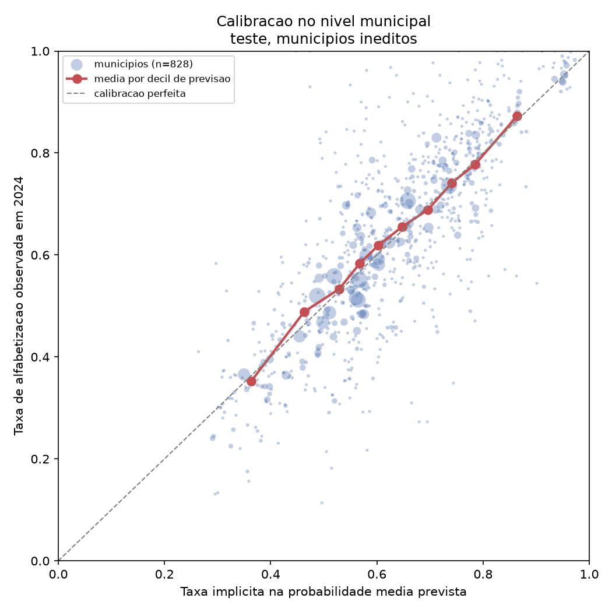

# Calibracao da taxa municipal

A analise de risco de meta usa a media das probabilidades individuais previstas como
estimativa da taxa municipal. Este relatorio verifica se essa leitura se sustenta.

A distincao importa: ROC AUC mede **ordenacao**. Um modelo pode ordenar bem sem que uma
previsao de 0,65 corresponda a 65% de alfabetizados. Sem esta verificacao, chamar a
media das probabilidades de "taxa projetada" seria uma afirmacao nao sustentada.

## Metodo

Comparacao entre a taxa observada em 2024 e a taxa implicita na probabilidade media
prevista, nos 828 municipios do conjunto de teste — todos ineditos
para o modelo, somando 243,746 alunos.

Consome apenas `reports/final_test_municipal_analysis.csv`, artefato ja versionado.
**Nao ha retreino nem reabertura do conjunto de teste.**

## Resultado agregado

| Metrica | Valor |
|---|---:|
| Media observada | 0.6312 |
| Media prevista | 0.6260 |
| Vies (previsto menos observado) | -0.0051 |
| MAE | 0.0877 |
| RMSE | 0.1193 |
| MAE ponderado por aluno | 0.0540 |
| Correlacao de Pearson | 0.7742 |

O MAE ponderado por aluno (0.0540) e bem menor que o
MAE simples (0.0877). A razao e estatistica: municipios pequenos tem taxa
observada ruidosa, porque poucas dezenas de alunos produzem variacao amostral alta. Onde
ha mais alunos, a previsao acerta mais.

## Calibracao por faixa

| Decil | Municipios | Previsto | Observado | Desvio |
|---:|---:|---:|---:|---:|
| 1 | 83 | 0.3631 | 0.3519 | +0.0111 |
| 2 | 83 | 0.4634 | 0.4888 | -0.0255 |
| 3 | 83 | 0.5293 | 0.5333 | -0.0041 |
| 4 | 82 | 0.5674 | 0.5829 | -0.0155 |
| 5 | 83 | 0.6025 | 0.6185 | -0.0160 |
| 6 | 83 | 0.6479 | 0.6554 | -0.0075 |
| 7 | 82 | 0.6961 | 0.6887 | +0.0074 |
| 8 | 83 | 0.7414 | 0.7416 | -0.0002 |
| 9 | 83 | 0.7852 | 0.7777 | +0.0074 |
| 10 | 83 | 0.8643 | 0.8728 | -0.0085 |

O maior desvio entre previsto e observado em qualquer faixa e de 0.0255, ou seja, menos de tres pontos percentuais. A taxa implicita acompanha a observada ao longo de toda a faixa de previsao, e o vies agregado de -0.0051 e praticamente nulo. **A projecao esta bem calibrada no nivel municipal.**

## Encolhimento

O desvio-padrao das previsoes e 0.1471, contra
0.1883 do observado — razao de 0.7814.

Isso e o comportamento esperado de qualquer modelo: previsoes sao comprimidas em direcao
a media, porque o modelo so captura a parte explicavel da variacao. A consequencia
pratica e que o **ordenamento entre municipios e confiavel, mas a amplitude entre os
extremos e subestimada**. Um municipio previsto em 0,36 tende a estar de fato um pouco
abaixo disso, e um previsto em 0,86, um pouco acima.

## O contraste que importa

A correlacao de Pearson de 0.7742 no nivel municipal
contrasta com a ROC AUC de 0,6631 no nivel do aluno.

Nao ha contradicao: sao a mesma evidencia vista em duas escalas. O modelo tem pouco poder
para separar dois alunos do mesmo municipio, porque eles compartilham o mesmo vetor de
features — e a auditoria de granularidade mostrou que 99,82% dos alunos estao em perfis
ambiguos. Mas ao agregar por municipio, o ruido individual se cancela e resta o sinal
territorial, que e forte.

**Esta e a evidencia mais direta de que o produto entregue e um instrumento de
priorizacao territorial**, e nao um classificador individual.

## Limitacoes

A calibracao foi medida no nivel municipal, que e o nivel de uso. Nao foi avaliada
calibracao individual por curva de confiabilidade ou Brier score, nem aplicada
recalibracao por Platt ou isotonica — nao foram necessarias, dado o vies observado.

A verificacao usa os mesmos municipios da avaliacao final. Sao ineditos para o modelo,
mas a medicao e posterior a abertura do teste e deve ser lida como **analise de
robustez**, nao como parte do protocolo de selecao.
